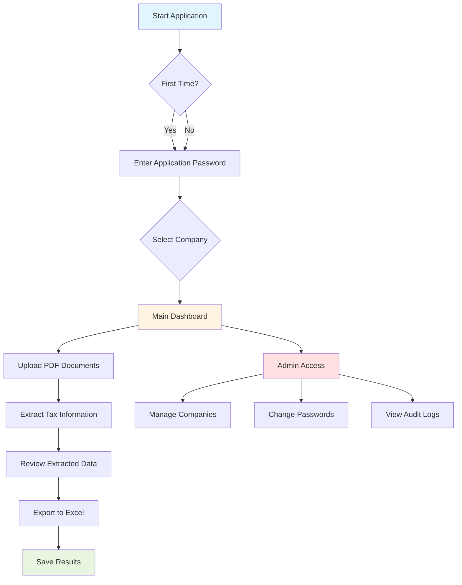
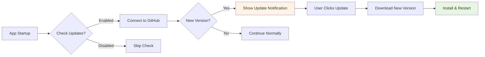

# Coretax Extractor - User Guide

## 📋 Overview

**Coretax Extractor** is a desktop application designed to streamline the process of extracting tax information from Indonesian tax documents (Bukti Potong PPh 23). The application provides a secure, user-friendly interface with automatic updates and multi-company support.

### Key Benefits

✅ **Fast & Accurate** - Extract tax data from PDF documents in seconds  
✅ **Multi-Company Support** - Manage multiple companies in one application  
✅ **Secure Access** - Password-protected with role-based access control  
✅ **Automatic Updates** - Always stay up-to-date with the latest features  
✅ **Data Export** - Export extracted data to Excel for further analysis

---

## 🎯 Application Flow

### Process Overview



---

## 🚀 Getting Started

### Step 1: Launch Application

When you first open **Coretax Extractor**, you'll see the login screen with the RSM logo.

**What You'll See:**
- Company selection dropdown
- Password input field
- Login button
- Admin settings icon (⚙️)

**Default Password:** `indonesia123`

> **💡 Tip:** Change the default password after first login for better security!

---

### Step 2: Select Your Company

Choose your company from the dropdown menu. The application comes pre-configured with common companies:

**Pre-configured Companies:**
- KAP Amir Abadi Jusuf Aryanto Mawar & Rekan
- RSM Indonesia Konsultan
- RSM Indonesia Mitradaya
- RSM Indonesia Mitradana
- AAJ Indonesia
- RSM Indonesia Advisory
- And more...

**Example:**
```
1. Click on company dropdown
2. Select "RSM Indonesia Konsultan"
3. Enter password: indonesia123
4. Click "Login"
```

---

### Step 3: Main Dashboard

After successful login, you'll access the main dashboard where you can:

#### 📤 Upload Documents
- Click **"Select PDF"** button
- Choose one or multiple PDF files
- Supported format: PDF documents (Bukti Potong PPh 23)

#### 🔍 Extract Information
The application automatically extracts:
- **Invoice Number** - Document invoice reference
- **Client Name** - Name of the client/taxpayer
- **No Bupot** - Tax withholding slip number
- **DPP** - Tax base amount
- **Nilai Pemotongan** - Withholding tax amount
- **Tanggal Bupot** - Tax slip date
- **Masa** - Tax period
- **NPWP** - Taxpayer identification number
- **Nama Pemotongan** - Withholding entity name

#### 💾 Export Results
- Review extracted data in the application
- Click **"Export to Excel"**
- Save file to your desired location
- Data includes all fields plus calculated variance

---

## 🔐 Admin Panel

### Accessing Admin Panel

1. Click the **⚙️ (Settings)** icon on the login screen
2. Enter admin credentials
   - **Default Username:** `admin`
   - **Default Password:** `admin`

> **⚠️ Important:** Change admin password immediately after first access!

---

### Admin Features

#### 1️⃣ Company Management

**Add New Company:**
```
1. Click "Add Company" button
2. Enter company name (e.g., "PT Example Indonesia")
3. Enter NPWP (e.g., "01.234.567.8-901.000")
4. Click "Save"
```

**Edit Existing Company:**
```
1. Find company in the list
2. Click "Edit" button
3. Update information
4. Click "Save Changes"
```

**Delete Company:**
```
1. Find company in the list
2. Click "Delete" button
3. Confirm deletion
```

#### 2️⃣ Security Settings

**Change Application Password:**
- This password is used by all users to access the application
- Minimum 4 characters

**Change Admin Password:**
- This password protects the admin panel
- Minimum 4 characters
- Use a strong, unique password

**Change Admin Username:**
- Customize the admin username
- Minimum 3 characters
- Only letters, numbers, underscore, and dash allowed

---

## 📊 Data Extraction Example

### Input: PDF Document
```
Document: Bukti Potong PPh 23
Pages: 1-2 pages
Format: Standard Indonesian tax form
```

### Output: Excel File

| Invoice No | Client | No Bupot | DPP | Nilai Pemotongan | Tanggal Bupot | Masa | NPWP | Nama Pemotongan |
|------------|--------|----------|-----|------------------|---------------|------|------|-----------------|
| INV-001 | PT ABC | BP-2023-001 | 10,000,000 | 200,000 | 15-Jan-2024 | Jan 2024 | 01.234.567.8-901.000 | PT XYZ |
| INV-002 | PT DEF | BP-2023-002 | 15,000,000 | 300,000 | 20-Jan-2024 | Jan 2024 | 98.765.432.1-098.000 | PT XYZ |

**Additional Calculated Fields:**
- **DPP x 2%** - Automatic calculation for verification
- **Variance** - Difference between actual and calculated
- **Selisih** - Variance indicator

---

## 🔄 Automatic Updates

The application checks for updates automatically (when enabled) and notifies you when a new version is available.

### Update Process



### How to Update

**When Update is Available:**
1. **Notification** appears with update details
2. Click **"Update Now"** button
3. Application downloads the update
4. Wait for download to complete
5. Application restarts automatically
6. You're now on the latest version!

**Manual Check:**
- Updates can be checked from the settings menu
- Current version is displayed in the application

---

## 📁 File Organization

### Where Files Are Stored

```
📦 CoretaxExtractor/
├── 📄 CoretaxExtractor.exe    # Main application
├── 📊 coretax.db               # Company database
├── 📊 coretax_data.db          # Application data
├── 📝 coretax_extraction.log   # Processing logs
└── 📋 version.json             # Version information
```

### Exported Data Location

By default, Excel files are saved to:
- **Desktop** or **Documents** folder
- You can choose a custom location when exporting

---

## 🎨 User Interface

### Color Scheme

The application uses **RSM Brand Colors** for a professional look:
- **Primary Grey:** #5A6670 (RSM official color)
- **Accent Blue:** For interactive elements
- **Success Green:** For confirmations
- **Alert Red:** For warnings and errors

### Screen Layout

```
┌─────────────────────────────────────────┐
│         RSM LOGO & APPLICATION          │
│              TITLE                      │
├─────────────────────────────────────────┤
│                                         │
│   [Company Dropdown ▼]                  │
│                                         │
│   [Password Field    ]                  │
│                                         │
│         [Login Button]                  │
│                                         │
│               ⚙️ Admin                  │
│                                         │
└─────────────────────────────────────────┘
```

---

## ❓ Common Questions

### Q: What file formats are supported?
**A:** The application supports PDF files, specifically Indonesian tax documents (Bukti Potong PPh 23).

### Q: Can I process multiple documents at once?
**A:** Yes! You can select and upload multiple PDF files simultaneously for batch processing.

### Q: Is my data secure?
**A:** Yes! All data is stored locally on your computer. Password-protected access ensures only authorized users can access the application.

### Q: What happens if extraction fails?
**A:** The application will show an error message and log the issue. You can retry or contact support for help.

### Q: Can I customize the company list?
**A:** Yes! Admin users can add, edit, or delete companies through the Admin Panel.

### Q: How do I reset my password?
**A:** Contact your system administrator to reset the application or admin password via database access.

---

## 🆘 Troubleshooting

### Issue: Cannot Login

**Possible Causes:**
- Wrong password
- Company not selected
- Database connection issue

**Solutions:**
```
1. Verify you've selected a company
2. Check password (default: indonesia123)
3. Contact admin if password was changed
4. Restart application
```

### Issue: PDF Not Processing

**Possible Causes:**
- File is corrupted
- File is not a valid PDF
- File is password-protected

**Solutions:**
```
1. Verify file opens in PDF reader
2. Remove password protection if any
3. Try re-scanning the document
4. Check file size (should be reasonable)
```

### Issue: Export Fails

**Possible Causes:**
- No data to export
- Permission denied on save location
- Disk space full

**Solutions:**
```
1. Verify data was extracted successfully
2. Choose different save location
3. Check available disk space
4. Close Excel if file is already open
```

---

## 📞 Support & Contact

### Need Help?

For technical support or questions about the application:

1. **Check the logs** - Review `coretax_extraction.log` for error details
2. **Contact your IT team** - They can help with installation and configuration
3. **Review documentation** - Check this guide for common solutions

### Reporting Bugs

When reporting issues, please provide:
- Application version (shown in settings)
- Steps to reproduce the issue
- Screenshot of error message
- Log file excerpt if available

---

## 📝 Version Information

**Current Version:** 1.1.0  
**Release Channel:** Stable  
**Auto-Update:** Configurable in `version.json`

### Version History

- **v1.1.0** - Added auto-update feature, improved UI
- **v1.0.0** - Initial release with core extraction features

---

## 🎓 Best Practices

### For Regular Users

✅ **Always select the correct company** before logging in  
✅ **Review extracted data** before exporting to Excel  
✅ **Use consistent file naming** for exported Excel files  
✅ **Keep PDF files organized** in dedicated folders  
✅ **Log out after use** in shared environments

### For Administrators

✅ **Change default passwords** immediately after installation  
✅ **Regularly backup** the database files  
✅ **Review audit logs** periodically for security  
✅ **Keep company list** up-to-date  
✅ **Enable automatic updates** for latest features and security patches

---

## 🔒 Security Notes

### Password Management

- **Application Password:** Used by all users, change regularly
- **Admin Password:** Protects sensitive operations, use strong password
- **Passwords are hashed:** Never stored in plain text

### Data Privacy

- All data stored locally on your computer
- No cloud synchronization or external data transmission
- Company and tax information remain confidential

### Audit Trail

- All admin actions are logged
- Logs include timestamps and action details
- Accessible through Admin Panel

---

## 📚 Glossary

| Term | Description |
|------|-------------|
| **NPWP** | Nomor Pokok Wajib Pajak (Tax Identification Number) |
| **Bupot** | Bukti Potong (Tax Withholding Slip) |
| **DPP** | Dasar Pengenaan Pajak (Tax Base) |
| **PPh 23** | Pajak Penghasilan Pasal 23 (Income Tax Article 23) |
| **Masa** | Tax Period |
| **Nilai Pemotongan** | Withholding Tax Amount |

---

## ⚡ Quick Reference Card

```
┌──────────────────────────────────────────────────┐
│               QUICK REFERENCE                     │
├──────────────────────────────────────────────────┤
│ Default App Password:    indonesia123            │
│ Default Admin Username:  admin                   │
│ Default Admin Password:  admin                   │
├──────────────────────────────────────────────────┤
│ COMMON TASKS:                                    │
│ • Login:           Select Company → Enter Pass   │
│ • Upload PDF:      Select PDF → Process          │
│ • Export Data:     Review → Export to Excel      │
│ • Add Company:     Admin → Company Mgmt → Add    │
│ • Change Password: Admin → Security Settings     │
└──────────────────────────────────────────────────┘
```

---

**🎉 You're ready to use Coretax Extractor!**

For additional help or questions, please contact your system administrator.